# Zeal Clinic Dashboard

<p align="center">
  <strong>The staff dashboard of Zeal Clinic, a clinic-management system built for an aesthetic clinic in
  Lebanon: React 19 and TypeScript, built into the clinic's own server and used from any browser on the
  clinic's network.</strong>
</p>

<p align="center">
  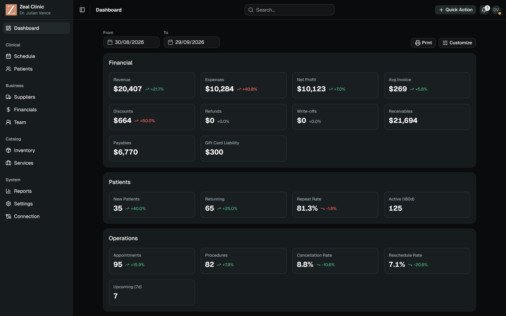
</p>

Zeal Clinic covers the working day of an aesthetic-medicine clinic: the appointment book by room and hour,
patient records with allergies, medicines and prescriptions, invoices, payments and balances, gift cards and
offers, stock and suppliers, the price list, staff schedules and salaries, reports and an audit trail. It was
built for one clinic in Lebanon. The server runs on a Windows PC in the clinic and staff use it from browsers
on the clinic's network; a copy in the cloud stays in sync with it both ways, so the clinic can also be
reached from outside. Only staff sign in, and what each person sees follows their role.

This repository is the dashboard. It has no server of its own: its build is copied into the Go backend,
embedded in both of the backend's builds (the clinic's Windows program and the cloud's Linux one) and served
from the same origin as the API. The constraints are the interesting part. The app must run from a PC on a
local network without loading anything from elsewhere, show every date in the clinic's time zone whatever the
browser's zone is, hide every action a role may not take using the same permission list the server enforces,
and stay usable on a phone.

Designers can start with the [visual showcase](#visual-showcase) and the [design system](#design-system);
developers with the [architecture](#architecture) and [getting started](#getting-started).

## Highlights

**The product**

- A day calendar of rooms against hours, where appointments are dragged to move or resized to change their
  length, with a table mode; a week view, Monday to Sunday, with counts per room and day; both print to PDF
- Several procedures per appointment, each with its own assignee, and five statuses: Scheduled,
  In-Progress, Completed, Cancelled and Rescheduled
- Completing a visit is a three-step wizard: notes, then an invoice prefilled with the visit's procedures,
  then a payment prefilled with the invoice total
- A one-page patient record: details, allergies, medicines, appointments, prescriptions, invoices, the
  balance and its payments
- Invoices with product, procedure, gift-card and other lines; new patients and new invoices are kept as
  drafts while you type and listed beside the form until you sign out
- An analytics dashboard of 14 cards of figures and tables over a date range (the last 30 days by default),
  with cards that can be hidden and a printable PDF
- Header search across patients, employees, suppliers, procedures and products, showing only the groups the
  user may read
- Notifications for appointment reminders 30 minutes ahead, low stock and sync failures, delivered live
- Light and dark themes and a UI scale from 80 to 170 percent, remembered per browser

**The build**

- React 19.2, TypeScript 6.0, Vite 7.3, Tailwind CSS 4.2 and shadcn components on Base UI
- 44 route entries; the sign-in page and the layouts ship in the first chunk, and the other 35 pages load on
  first visit
- Routes, menu entries, tabs and buttons are shown or hidden by the same 82 permission scopes the API checks,
  through 157 permission checks in the code
- One HTTP client unwraps the server's `{Success, Data, Error}` envelope and handles 401 and 403 in one
  place; lists are paged, searched, sorted and filtered on the server, 100 rows at a time
- The clinic's time zone throughout, whatever the browser's: time-zone conversion lives in one module,
  `src/lib/tz.ts`, and time inputs refuse times that don't exist or occur twice at a daylight-saving change
- Hand-written controlled forms without a form library; one `FormField` component labels every field
  (169 uses)
- 20 small Zustand stores; the session lives in `sessionStorage`, so each browser tab signs in on its own
- 306 unit tests, run in two time zones, and 317 browser tests, including a walk of all 44 routes as each of
  four roles
- 396,283 bytes of JavaScript gzipped (1,215,865 raw), with a size budget checked on every CI run

## Visual showcase

### Light and dark

<table>
  <tr>
    <td width="50%">
      <a href="docs/images/zeal-clinic-dashboard-light.png">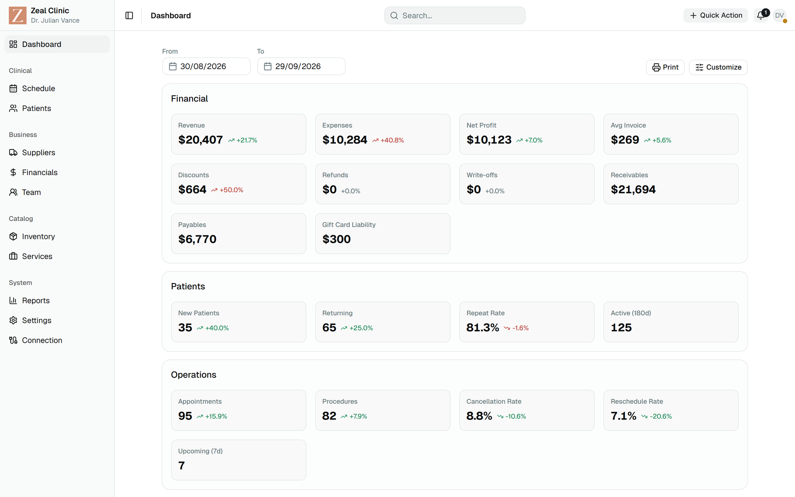</a>
    </td>
    <td width="50%">
      <a href="docs/images/zeal-clinic-dashboard-dark.png"></a>
    </td>
  </tr>
  <tr>
    <td align="center">Dashboard, light</td>
    <td align="center">Dashboard, dark</td>
  </tr>
</table>

Dark is the default theme. Both themes run on the same components; the difference lives in two sets of
colour tokens in `src/globals.css`, described under [Design system](#design-system).

<table>
  <tr>
    <td width="50%">
      <a href="docs/images/zeal-clinic-schedule-day.png"></a>
    </td>
    <td width="50%">
      <a href="docs/images/zeal-clinic-schedule-week.png">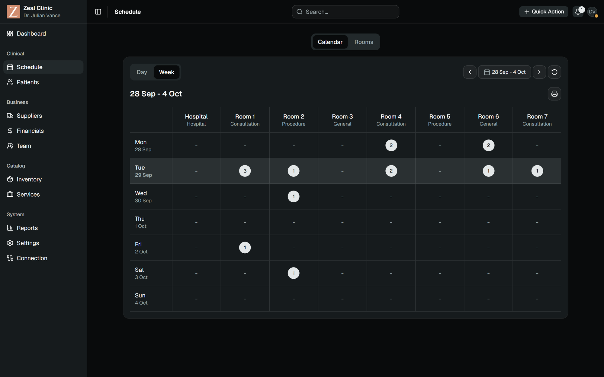</a>
    </td>
  </tr>
  <tr>
    <td align="center">Day view, rooms by the hour</td>
    <td align="center">Week view, Monday to Sunday</td>
  </tr>
</table>

The day view lays the eight seeded rooms against the hours, with a line at the current time; each
appointment carries its status as a coloured rail on its left edge. The week view counts appointments per
room and day, Monday to Sunday, and opens a day on click.

<table>
  <tr>
    <td width="33%">
      <a href="docs/images/zeal-clinic-patient-record.png">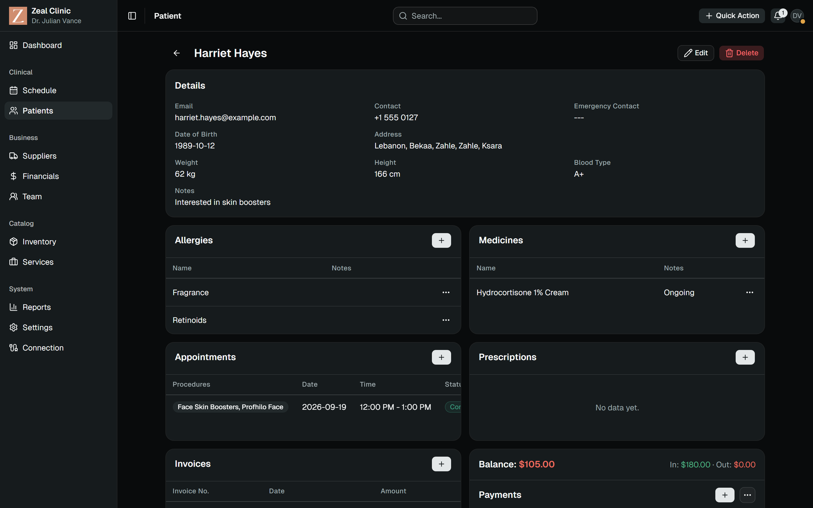</a>
    </td>
    <td width="33%">
      <a href="docs/images/zeal-clinic-new-invoice.png">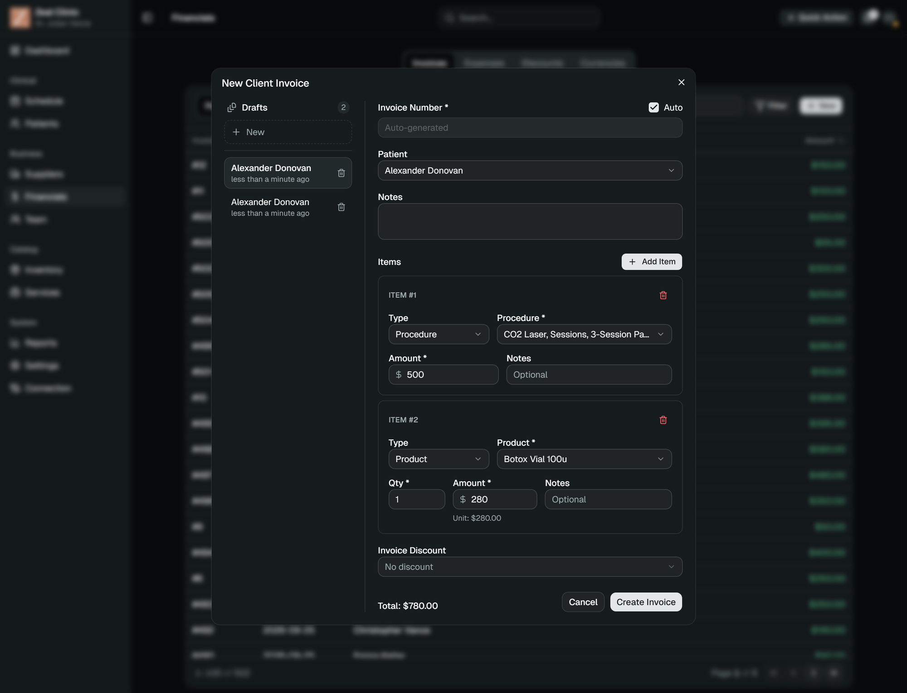</a>
    </td>
    <td width="33%">
      <a href="docs/images/zeal-clinic-invoice.png">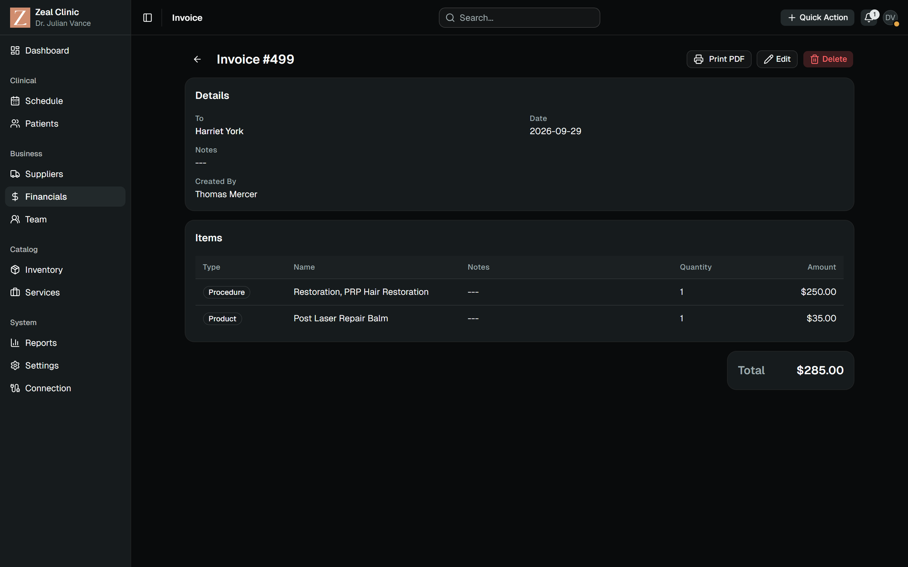</a>
    </td>
  </tr>
  <tr>
    <td align="center">Patient record</td>
    <td align="center">New invoice with drafts</td>
    <td align="center">Invoice</td>
  </tr>
</table>

The patient record is a single page rather than tabs. The New Client Invoice dialog saves a draft 700 ms after
the last edit and lists the drafts in a rail beside the form, a sheet on phones; they stay in the browser until
sign-out.

<table>
  <tr>
    <td width="33%">
      <a href="docs/images/zeal-clinic-wizard-complete.png">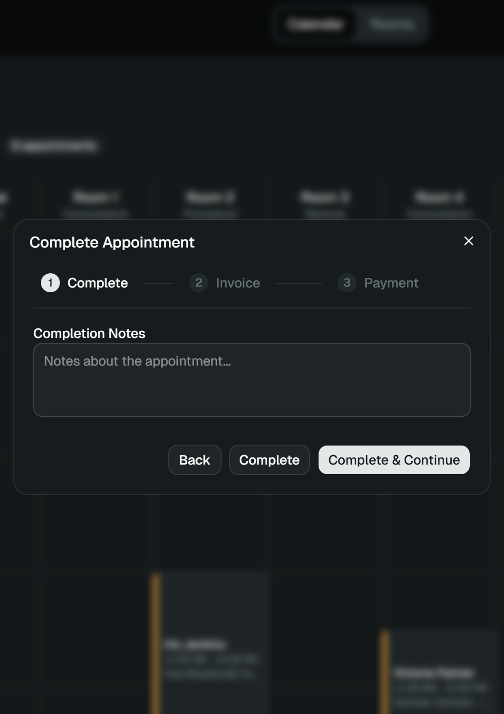</a>
    </td>
    <td width="33%">
      <a href="docs/images/zeal-clinic-wizard-invoice.png">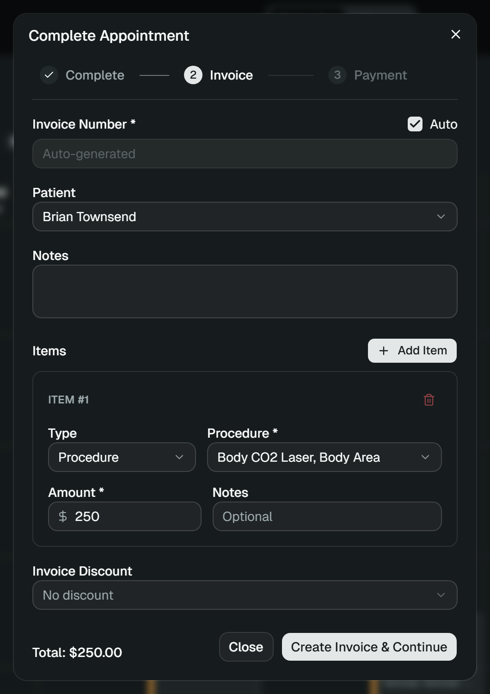</a>
    </td>
    <td width="33%">
      <a href="docs/images/zeal-clinic-wizard-payment.png">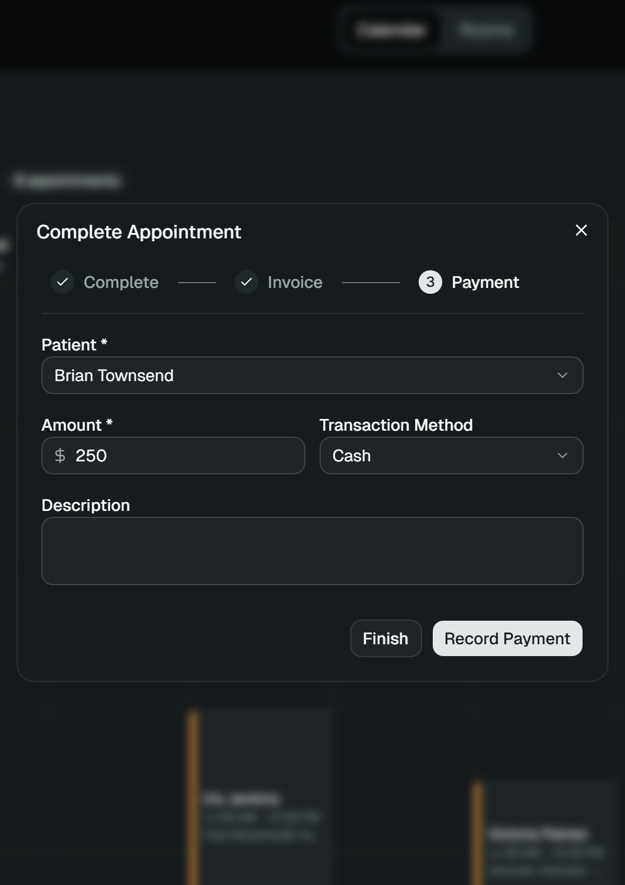</a>
    </td>
  </tr>
  <tr>
    <td align="center">Step 1, Complete</td>
    <td align="center">Step 2, Invoice, prefilled</td>
    <td align="center">Step 3, Payment, prefilled</td>
  </tr>
</table>

"Complete & Continue" and "Create Invoice & Continue" move on to the next step; "Complete", "Close" and
"Finish" stop where they are, so the invoice or the payment can wait for later.

<table>
  <tr>
    <td width="33%">
      <a href="docs/images/zeal-clinic-phone-dashboard.png">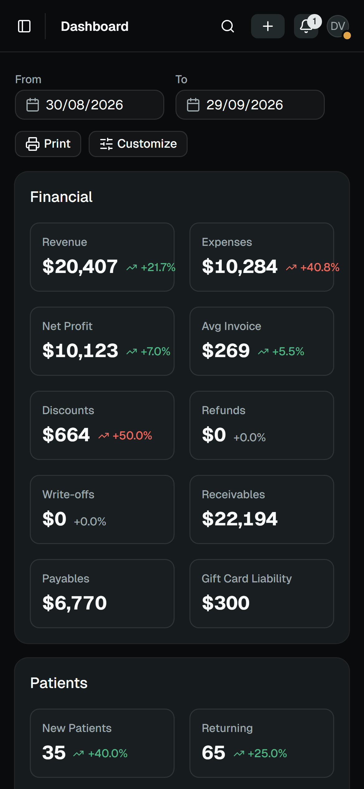</a>
    </td>
    <td width="33%">
      <a href="docs/images/zeal-clinic-phone-schedule.png">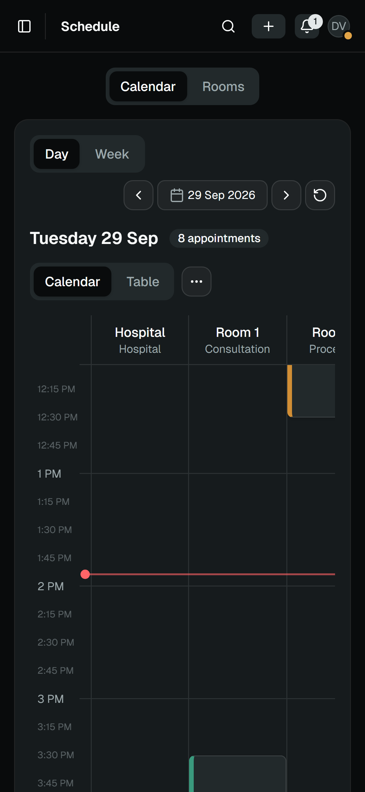</a>
    </td>
    <td width="33%">
      <a href="docs/images/zeal-clinic-phone-patient.png">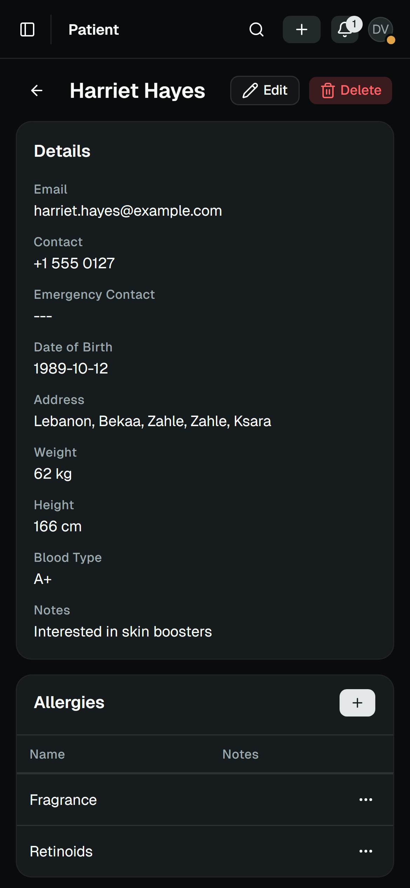</a>
    </td>
  </tr>
  <tr>
    <td align="center">Dashboard on a phone</td>
    <td align="center">Day view on a phone</td>
    <td align="center">Patient record on a phone</td>
  </tr>
</table>

Below 842 pixels the sidebar and the drafts rail become sheets; below 640 the header search and Quick Action
shrink to icons. The calendar keeps a grid about 900 pixels wide and scrolls sideways, so on a phone the day
view's table mode is the practical one.

## Design system

The interface uses shadcn components in the `base-nova` style, built on Base UI rather than Radix, with the
`mist` base colour and lucide icons. Tailwind CSS 4 is configured in CSS: the tokens live in
`src/globals.css` (`:root` for light, `.dark` for dark, mapped to utilities in `@theme inline`), and there is
no `tailwind.config`. Every colour is written in oklch.

<p align="center">
  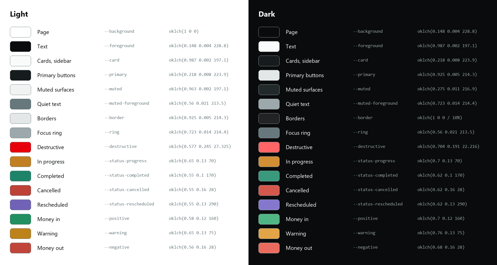
</p>

### Colour tokens

| Token | Used for | Light | Dark |
| --- | --- | --- | --- |
| `background` / `foreground` | Page and text | `oklch(1 0 0)` / `oklch(0.148 0.004 228.8)` | `oklch(0.148 0.004 228.8)` / `oklch(0.987 0.002 197.1)` |
| `card` | Cards and the sidebar | `oklch(0.987 0.002 197.1)` | `oklch(0.218 0.008 223.9)` |
| `primary` / `primary-foreground` | Primary buttons | `oklch(0.218 0.008 223.9)` / `oklch(0.987 0.002 197.1)` | `oklch(0.925 0.005 214.3)` / `oklch(0.218 0.008 223.9)` |
| `secondary`, `muted`, `accent` | Quiet surfaces, hovers | `oklch(0.963 0.002 197.1)` | `oklch(0.275 0.011 216.9)` |
| `muted-foreground` | Labels and secondary text | `oklch(0.56 0.021 213.5)` | `oklch(0.723 0.014 214.4)` |
| `border` / `input` | Borders and fields | `oklch(0.925 0.005 214.3)` | `oklch(1 0 0 / 10%)` / `oklch(1 0 0 / 15%)` |
| `ring` | Focus ring | `oklch(0.723 0.014 214.4)` | `oklch(0.56 0.021 213.5)` |
| `destructive` | Delete and sign-out | `oklch(0.577 0.245 27.325)` | `oklch(0.704 0.191 22.216)` |
| `status-progress` | In progress | `oklch(0.65 0.13 70)` | `oklch(0.7 0.13 70)` |
| `status-completed` | Completed | `oklch(0.55 0.1 170)` | `oklch(0.62 0.1 170)` |
| `status-cancelled` | Cancelled | `oklch(0.55 0.16 28)` | `oklch(0.62 0.16 28)` |
| `status-rescheduled` | Rescheduled | `oklch(0.55 0.13 290)` | `oklch(0.62 0.13 290)` |
| `positive` / `warning` / `negative` | Money in, warnings, money out | `oklch(0.58 0.12 160)` / `oklch(0.65 0.13 75)` / `oklch(0.56 0.16 28)` | `oklch(0.7 0.12 160)` / `oklch(0.76 0.13 75)` / `oklch(0.68 0.16 28)` |

The neutrals are cool, low-chroma grey-blues (hue 197 to 229), so the interface reads as nearly monochrome and
colour is kept for meaning: the four appointment statuses, the direction of money and destructive actions.
Cancelled and money-out share one red, the same hue (28) and chroma (0.16), held near the status ramp's
lightness rather than at the alarm level of `destructive`. The brand's warm amber, `oklch(0.72 0.13 45)`, appears only in the loading overlay
around the clinic's logo.

### Typography

Geist Variable, self-hosted through `@fontsource-variable/geist`, sets headings and body, and `ui-monospace`
sets identifiers such as role names, gift codes, the version and the server address. The scale is compact:
page titles and key figures at `text-xl`, card and dialog titles at `text-base`, body text and tables at
`text-sm`, labels and meta at `text-xs`. Weights stay mostly at medium, and figures use tabular numbers so
amounts line up in columns.

### Shape, space and scale

One radius token, `--radius: 0.625rem`, gives seven steps from 0.6 to 2.6 times its size. Spacing is
Tailwind's default rem scale. The UI scale in the Staff menu changes the root font size, so text, spacing and
radius grow together from 80 to 170 percent in steps of 10.

### Components and icons

`src/components/ui` holds 24 component files, from alert dialogs to tooltips (the chart wrapper among them is
not used by any screen), composed with Base UI's `render` prop; the shadcn base CSS (4.5.0) is vendored in `src/styles/` with its MIT header. Form dialogs go
through one `Modal`, and there is no select element: each choice is a searchable dropdown, with an Add new
button where the user may create the missing item. Icons come from `lucide-react`; toasts from `sonner` follow
the theme.

<table>
  <tr>
    <td width="50%">
      <a href="docs/images/zeal-clinic-sign-in.png">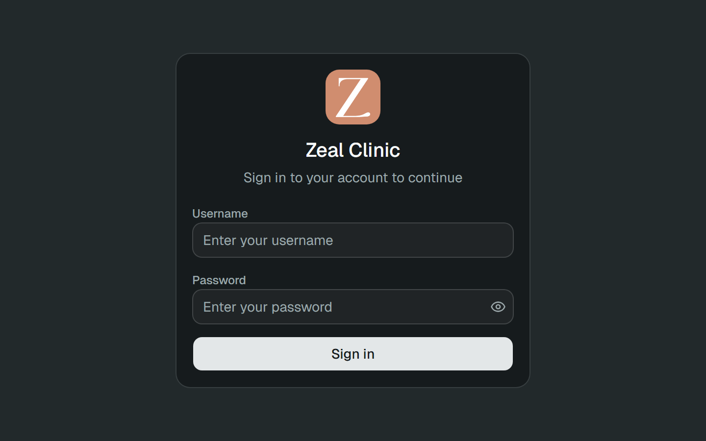</a>
    </td>
    <td width="50%">
      <a href="docs/images/zeal-clinic-staff-menu.png">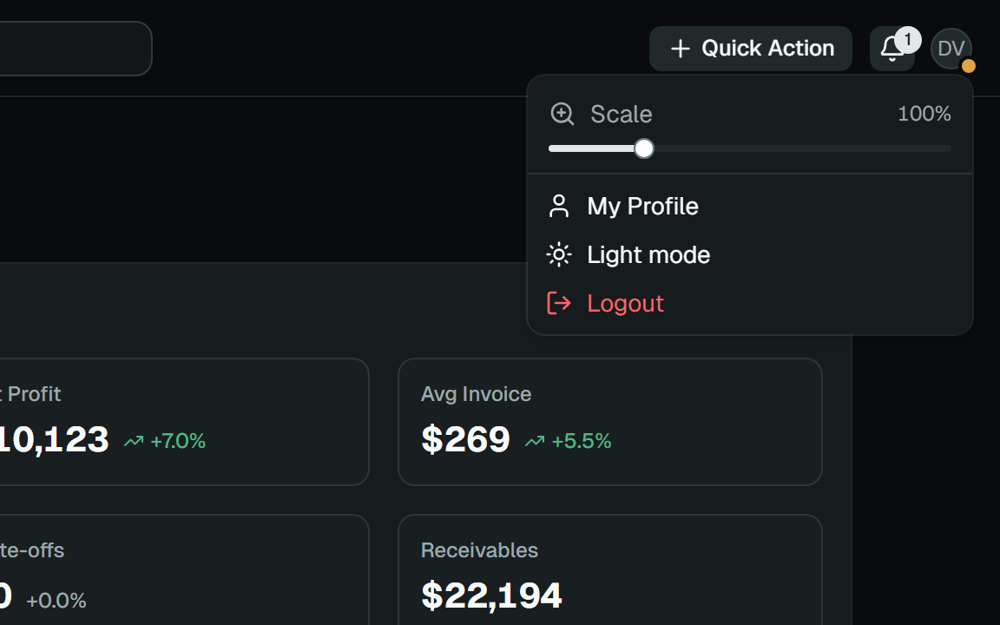</a>
    </td>
  </tr>
  <tr>
    <td align="center">Sign-in</td>
    <td align="center">Theme and scale in the Staff menu</td>
  </tr>
</table>

### Light and dark

Dark is the default: `index.html` ships with the `dark` class on a black background, so the first paint is
already dark, and the saved choice is applied once the app loads. The Staff menu switches between Light mode
and Dark mode.

### Responsive layout

| Width | What changes |
| --- | --- |
| Below 842 px | The sidebar becomes a slide-in sheet 13 rem wide, and the drafts rail a "Drafts (n)" sheet |
| Below 640 px | The header search becomes an icon with a popover, Quick Action shows only "+", padding shrinks and dialogs take the full width |
| `md` and `xl` | The dashboard's cards flow into two and then three columns; the Financial, Patients, Operations and Demographics cards span them all |
| Desktop | The sidebar collapses to a 3 rem icon rail with tooltips |

### Keyboard and accessibility

- Ctrl+B (Cmd+B on a Mac) toggles the sidebar; it is the only global shortcut
- Enter and Space open table rows, calendar hours, week days, cards and notifications; Escape cancels an
  appointment drag
- The staff schedule grid is a single Tab stop, moved through with the arrow keys
- Every form field has a linked label through `FormField`; icon-only buttons are named (57 `aria-label`
  attributes); sort headers are buttons with `aria-sort`; the active tab carries `aria-current="page"`
- The loading overlay and the force-sync progress are live regions, and the connection dot also states its
  meaning in text
- The browser tests find fields by their labels, so an unlabelled field fails the suite; keyboard flows have
  their own spec
- Not yet in place: a skip link and reduced-motion handling

## Architecture

The app is a single-page React app with one router, one HTTP client, a set of small stores and one event
stream from the server.

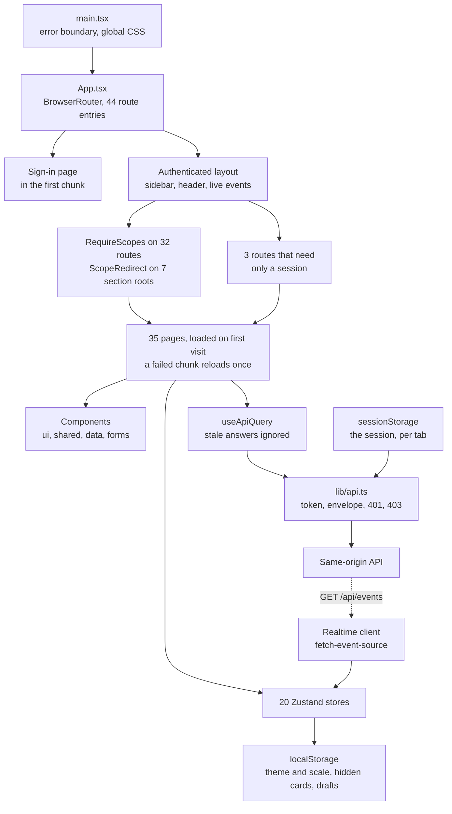

**Routes are guarded with the server's scopes.** `RequireScopes` wraps 32 routes, `ScopeRedirect` sends the 7
section roots (patients, schedule, inventory, financials, services, team, settings) to the first tab the user
may open, and `/dashboard`, `/profile` and `/connection` need only a session. The scope list in
`src/lib/scopes.ts` mirrors the server's, and the backend's contract tests compare the two lists, so they
can't drift apart.

**Pages load on demand.** The sign-in page and the layouts are in the first chunk; every other page is a lazy
chunk behind a Suspense boundary per layout. A page whose chunk fails to load, typically because the server was
updated while the tab was open, reloads once instead of failing. Signing in returns you to the page you asked
for, internal paths only.

**One client talks to the API.** `src/lib/api.ts` adds the Bearer token, unwraps `{Success, Data, Error}`,
signs out on 401 and shows a single "You don't have permission to do that." toast on 403. `useApiQuery` ignores
stale answers, so nothing lands after a screen closes. In development the client calls
`http://localhost:55555/api`, or the origin in `VITE_API_BASE_URL`; a production build calls its own origin.

**State is small and local.** 20 Zustand stores, one per concern. Three persist in `localStorage`:
`ui-settings` (theme, scale, sidebar), `dashboard-layout` (hidden cards) and `form-drafts`. The session keys sit
in `sessionStorage` and are cleared, with the drafts, on every sign-out and expiry.

**Forms are plain components.** 35 entity forms plus the appointment dialog and its completion wizard, all
controlled components in dialogs that hold their state in `useState`, with no form library. A dialog's body mounts only
while it is open, so it starts fresh every time. Money inputs round to two decimals, and date and time inputs
reject clinic times that don't exist or are ambiguous at a daylight-saving change.

### Live events

`GET /api/events` is a per-user stream of server-sent events. The client uses `@microsoft/fetch-event-source`
rather than `EventSource`, so the token travels in a header; it retries from 1 to 30 seconds, reconnects when
the network returns and stays open in hidden tabs.

| Event | What the open tab does |
| --- | --- |
| `hello` | Marks the stream connected and reloads the unread count |
| `notification` | Adds the notice to the bell and shows a toast |
| `notifications_changed` | Reloads the unread count, and the list if the bell is open |
| `scopes_changed` | Reloads the session's permissions, so routes, menus and buttons change at once |
| `account_disabled` | Signs out |
| `data_changed` | Shows "Syncing completed." after sync or a force sync wrote data, or after missed events |
| `cloud_connection` | Colours the connection dot on the Staff menu |
| `cloud_restore_progress` | Shows the force-sync progress dialog |

Plain edits don't push events: another open tab sees them on its next load.

### From source to the server's two builds

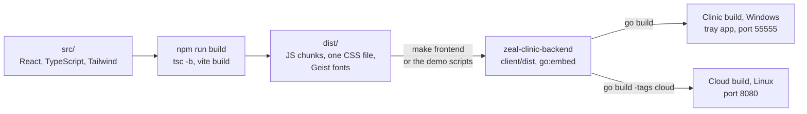

Each build serves the dashboard and the API on one origin: it serves the app shell with a content security policy that allows only its own origin, injects the
clinic's time zone as a `clinic-timezone` meta tag, and answers unknown paths with the app shell, so client-side
routes survive a reload. Paths are root-absolute, so the app is served at the root of its host.

## Technology

- React 19.2.5 and React DOM, TypeScript 6.0.3
- Vite 7.3.6 with `@vitejs/plugin-react` 5.2.0
- React Router 7.18.2 (`react-router-dom`)
- Tailwind CSS 4.2.4 through `@tailwindcss/vite`, `tw-animate-css` 1.4.0
- Base UI 1.4.1 (`@base-ui/react`) under shadcn `base-nova` components, class-variance-authority 0.7.1,
  clsx 2.1.1, tailwind-merge 3.5.0
- Zustand 5.0.12
- TanStack Table 8.21.3
- date-fns 4.1.0, date-fns-tz 3.2.0, react-day-picker 9.14.0
- `@microsoft/fetch-event-source` 2.0.1
- lucide-react 1.11.0, sonner 2.0.7, motion 12.38.0, qrcode.react 4.2.0
- Geist Variable through `@fontsource-variable/geist` 5.2.8
- Vitest 4.1.11 with `@vitest/coverage-v8` and jsdom 29.1.1; Playwright 1.63.0; pdfjs-dist 6.3.289 to read
  generated PDFs in tests
- ESLint 10.2.1 with typescript-eslint 8.59.0 and the React Hooks and React Refresh plugins
- Node 24 (`.nvmrc`); `engines` accepts `^20.19.0 || ^22.13.0 || >=24.0.0`

Not used: a form or validation library, and a Vite proxy. Forms are plain controlled components, and in
development the client calls the backend directly, which accepts the Vite origins only in `--dev` runs.
Installed but unused: Recharts 3.8.0. Only two files import it, an analytics chart card and the chart
wrapper, and no screen uses either; every screen shows figures and tables, not charts.

## Repository map

| Path | Responsibility |
| --- | --- |
| `src/App.tsx` | Every route, its guard and its lazy page |
| `src/pages/` | One folder per section, plus the dashboard, sign-in and profile pages; `layouts/` holds the shell and the 7 tab layouts, `schedule/components/` the day and week views and the drag engine |
| `src/components/ui/` | The 24 shadcn component files on Base UI; the chart wrapper among them is unused |
| `src/components/layout/` | The shell: sidebar, header search, quick actions, notifications, Staff menu, the live-event subscriber and the session watch |
| `src/components/shared/` | `Modal`, `SearchableDropdown`, `FormField`, date and money inputs, route tabs, the drafts rail, the staff schedule views |
| `src/components/data/` | Server-paged lists and TanStack tables |
| `src/components/forms/` | The entity forms, and `appointment-form/` with the completion wizard |
| `src/components/analytics/` | The dashboard's cards |
| `src/lib/` | The HTTP client, time-zone helpers, scopes, types, keyboard helpers, the realtime client and the Zustand stores |
| `src/hooks/` | Data loading, permissions, drafts, page titles, confirmations, the phone breakpoint |
| `src/globals.css`, `src/styles/` | The theme tokens and the vendored shadcn CSS |
| `public/` | The clinic's logo and icon |
| `tests/unit/` | Vitest tests |
| `e2e/` | Playwright: the per-role route walk, flows, mobile, dark, foreign time zone, serial and visual projects, with their helpers and goldens |
| `scripts/` | `ci.ps1` (every CI stage), `check-bundle.mjs` and the ratchet baselines |
| `.github/workflows/` | `ci.yml` and `nightly.yml` |
| `docs/` | The user guide PDF and the images in this README |

## Getting started

**Prerequisites.** Node `^20.19.0 || ^22.13.0 || >=24.0.0` (`.nvmrc` says 24) and npm. To run the dashboard
against data you also need the backend: Go 1.26.8 (an older Go 1.21 or newer downloads it once while
`GOTOOLCHAIN` is `auto`, the default) and, on Windows, PowerShell 7.

**The whole system in one command.** The one-command demo lives in the backend repository and expects this
repository next to it as `zeal-clinic-frontend`:

```bash
git clone https://github.com/Elia-Youssef/zeal-clinic-backend
git clone https://github.com/Elia-Youssef/zeal-clinic-frontend
cd zeal-clinic-backend
```

Then, on Windows (the clinic edition):

```powershell
pwsh scripts/demo.ps1        # or: make demo
```

Or on Linux (the cloud edition):

```bash
sh scripts/demo-cloud.sh     # or: make demo
```

It builds this dashboard with `npm ci` and `npm run build`, embeds it, seeds demo data and prints
`Demo ready: http://127.0.0.1:55555` (port 8080 for the cloud edition). The two-node demo and the note for ZIP
downloads are in the [backend README](https://github.com/Elia-Youssef/zeal-clinic-backend#getting-started).

**Working on the dashboard.** Run the backend's development server with demo data, then the Vite dev server
here. On Windows, in `zeal-clinic-backend`:

```powershell
go run ./cmd/server --dev --seed-only --demo   # migrate and seed demo data into ./tmp, then exit
go run ./cmd/server --dev                      # the API on http://localhost:55555
```

Then in this repository:

```bash
npm ci
npm run dev                                    # http://localhost:5173
```

There is no proxy: the dev client calls `http://localhost:55555/api` directly, and the backend accepts those
cross-origin calls only when started with `--dev`. On Linux or macOS, run the cloud edition instead
(`go run -tags cloud ./cmd/server --dev --seed-only --demo`, then `go run -tags cloud ./cmd/server --dev`,
port 8080) and point the dev server at it with `VITE_API_BASE_URL=http://localhost:8080` (see
`.env.example`). A cloud node without its clinic keeps money writes read-only.

**Checks.**

```bash
npm run typecheck   # the app, Node and test tsconfig projects
npm run lint
npm run test:unit   # Vitest
npm run build       # tsc -b and vite build, into dist/
```

`npm run test:e2e` needs a seeded backend on port 55580; the `e2e` stage of `scripts/ci.ps1` builds, seeds,
starts and stops it from a backend checkout.

### Operating the dashboard

Sign in with the password `demo123` as `jvance` (admin, every screen), `tmercer` (staff) or `lhayes` or
`mowens` (nurses). The demo holds 152 invented patients with appointments around today, invoices, payments,
expenses and gift cards; its dates are anchored to the day it was seeded, and the calendar opens on today.

The role decides what appears. Staff don't see Reports; under Team they see the holidays and under Settings
only About, and currencies are read-only. Nurses see the schedule without editing it, patients without
invoices or payments, inventory and services, and no suppliers, financials, team, reports or settings.
Every screen shares the header: Search, Quick Action (New Patient, New Appointment, New Invoice), the
notifications bell and the Staff menu with the scale, My Profile, the theme and Logout.

Each browser tab has its own session: a new tab asks you to sign in, and closing the tab ends the session.

## Verification

Every stage runs through `scripts/ci.ps1`, the same way locally and on GitHub Actions. Because the stages
change the checkout they run in, the script refuses to run anywhere but a GitHub runner or a throwaway clone
marked with an empty `.ci-scratch` file at its root.

| Gate | What it proves | Current |
| --- | --- | --- |
| `typecheck` | The app, the Node config and the tests type-check, three tsconfig projects | Clean |
| `lint` | ESLint with the React Hooks and React Refresh rules; the warning count may not grow | 0 errors, 1 known warning |
| `ui-unit` | Vitest, run once in Asia/Beirut and once in Pacific/Kiritimati | 306 tests in 31 files, in both zones |
| `build` | `tsc -b` and `vite build` | Pass |
| `bundle` | Raw JS, initial JS and CSS against a budget of +3 percent | JS 1,215,865 B (396,283 gzipped), initial JS 885,376 B, CSS 119,246 B |
| `audit` | `npm audit --omit=dev`; a new advisory fails | 0 advisories |
| `e2e` | Playwright against the real server built from the backend checkout: the per-role walk of every route, then flows, mobile, dark, a foreign time zone and serial scenarios | 317 passed in the last full run: 177 in the walk, 140 on scenario data |
| `workflows` | actionlint over the workflow files | Clean |

Of the 140 scenario tests, 40 are visual comparisons whose goldens are kept outside the repository, so the
`visual` project runs only where a golden folder is provided. On GitHub, `ci.yml` runs the static checks, unit
tests, build, bundle and audit on every push to `main` and every pull request, plus the smoke walk against the
backend; `nightly.yml` runs the full browser suite. The browser jobs run on Windows because the clinic edition
of the server is Windows-only.

## Repository scope

This repository is the complete dashboard: source, unit and browser tests, the CI script, its baselines and the
workflows. It has no server; the backend repository builds it into both of its editions and hosts the one-command demo,
and the browser tests start the real server from a backend checkout. Generated output (`dist/`,
`node_modules/`, test reports) is not committed, and neither are the visual goldens.

This README describes version 1.1.0. The tags `v0.1.0-beta`, `v0.2.10-beta`, `v0.4.0-beta`, `v1.0.0` and
`v1.0.3` are snapshots of the releases as they shipped. They are history rather than build targets: they
carry no `package-lock.json`, so `npm ci` fails there and `npm install` resolves newer packages.

## Connected repositories

- [zeal-clinic-backend](https://github.com/Elia-Youssef/zeal-clinic-backend): the Go server. The API, sync
  between the clinic and the cloud, PDFs, the encrypted database, the Windows tray app and the Linux cloud
  build; it embeds this dashboard and hosts the demos.

## User guide

[`docs/Zeal-Clinic-User-Guide.pdf`](docs/Zeal-Clinic-User-Guide.pdf) is the staff guide for version 1.1.0,
written for the people at the clinic rather than for developers: signing in, patients, appointments, billing,
inventory and suppliers, team and HR, the dashboard and reports, administration and help, illustrated with
the demo data. The same guide is in both repositories.

## Ownership and licensing

Copyright (c) 2026 Elia Youssef and Rebel Art Studios. All rights reserved.

No open-source license is granted. Unless a separate written agreement with the copyright holders grants
permission, the source is provided for viewing and portfolio reference only; see [LICENSE](LICENSE).

The "Zeal Clinic" name and logo and the clinic's price list belong to the clinic and are used with its
permission. They are not covered by this notice and may not be reused. Every person in the demo data and the
screenshots is invented.

Third-party components keep their own licenses; see [THIRD_PARTY_NOTICES.md](THIRD_PARTY_NOTICES.md).

Designed and built by Rebel Art Studios ([LinkedIn](https://www.linkedin.com/in/elia-youssef)).
